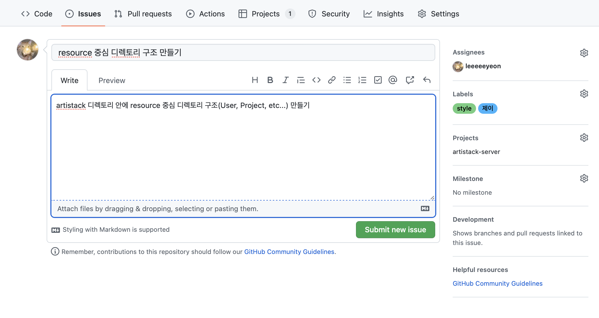
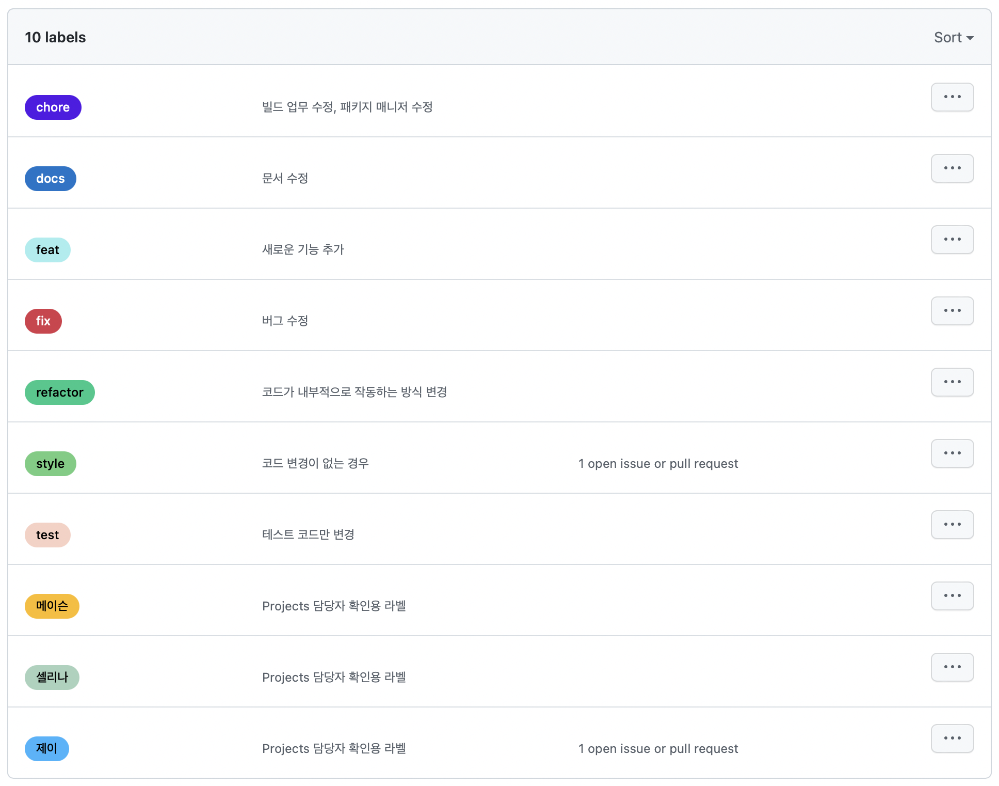
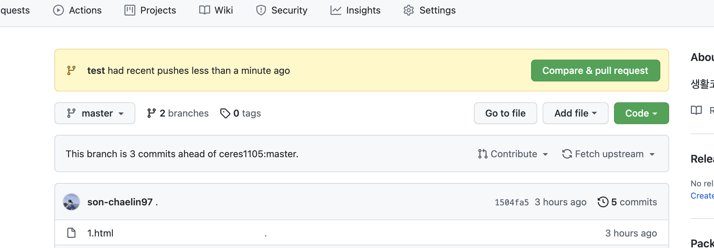
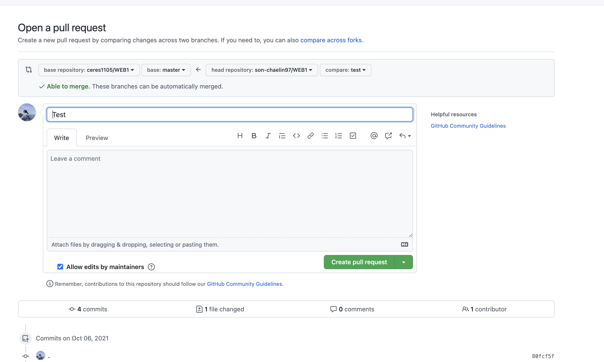

Github 사용법
=============

### 🚀 브랜치 종류 🚀
- `main` :  배포에 사용할 코드
- `dev` : 개발 완료된 코드
  * Pull request를 날릴 때, artistack-iOS의 `dev` 브랜치로!
- `feature` : 기능 개발중인 코드
  * 로컬에서 개발할 때, `feature/#(이슈번호)`로 브랜치 만들기
- `hotfix` : 기능 수정중인 코드

* * *

### 전체적인 사용 순서

1. artistack-iOS 레포지토리를 `fork`한다. (최초 1회)
2. 이슈(Issue)를 생성한다.
  > 이슈 작성 방법
  > 
  > - 제목과 본문은 자유롭게 작성
  > - Assignees : 담당자 태그 (자신일 경우, assign myself)
  > - Labels : 이슈 목적 및 담당자를 적절하게 선택
  >> 라벨 종류
  >> 
  >> 담당자를 다시 한 번 더 적는이유는 Projects 칸반보드에서 태그로 담당자를 확인하기 위함
  > - Projects : `artistack-iOS` 선택
  > - 💡 이슈 등록 시, Projects의 칸반보드로 자동 연동됨
3. 로컬에서 개발하면서 origin 저장소(fork한 저장소)에 코드를 `push`한다.
  > 📌 **commit 규칙** 📌
  >> `[#(이슈번호)] (commmit type) : (커밋 메세지)`
  >> 
  >> 📍 commit type
  >>  - **feat** : 새로운 기능 추가
  >>  - **fix** : 버그 수정
  >>  - **docs** : 문서 수정
  >>  - **stype** : 코드 포맷팅, 세미콜론 누락, 코드 변경이 없는 경우
  >>  - **refactor** : 코드 리팩토링
  >>  - **test** : 테스트 코드, 리팩토링 테스트 코드 추가
  >>  - **chore** : 빌드 업무 수정, 패키지 매니저 수정
  >>  
  >> `[#1] style : resource별로 디렉토리 구조 생성`
  >> 
  >> 해당 이슈번호에 해당하는 커밋에 커밋 기록이 남는다
4. pull request 보내기
  > ✈️ PR 날리는 방법
  >> 
  >> - `Compare & pull request` 클릭
  >>
  >> 
  >> - base repository : `artistack-server` 의 `dev` 브랜치
  >> - head repository : `fork 레포지토리`의 브랜치 (feature, hotvix 등 목적에 맞게 브랜치 만들어주세요)
  >> - PR 내용 자유롭게 작성 ( #(이슈번호) 입력 시 Issue와 연동 가능 )
  > - 나머지 두 명은 PR 읽고 Approve 해주기 (2명 모두 Approve 시, merge)
  > - **merge는 PR을 올린 당사자가 직접 하기**
5. merge 후 브랜치 삭제
6. 해당하는 issue 닫기 -> Projects의 칸반보드에서 `Done` 란으로 자동 이동
7. 작업하면서 꼭 pull 받고 하기
